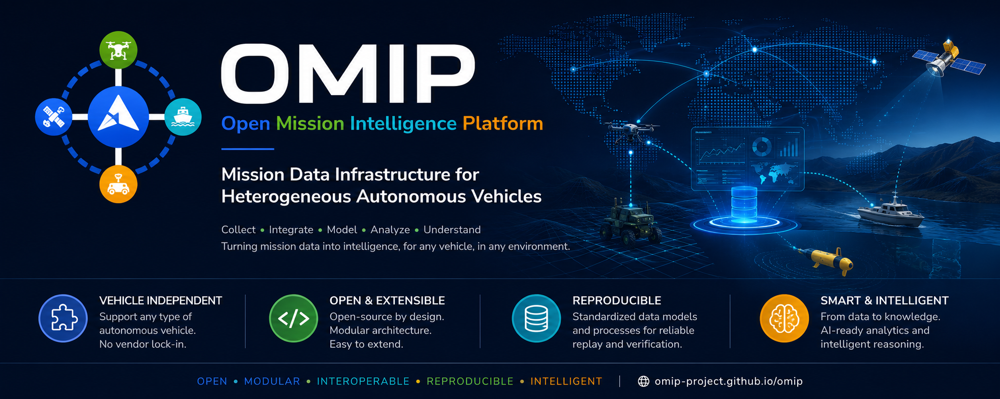
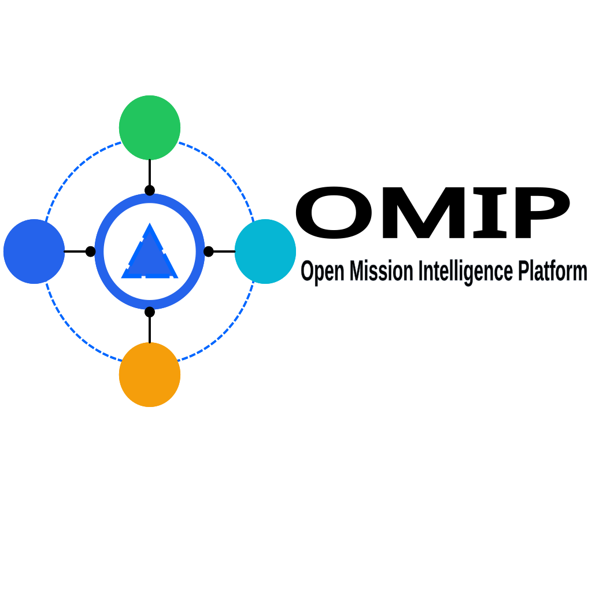

<div align="center">



<picture>
  <source media="(prefers-color-scheme: dark)" srcset="brand/logo/omip-logo-dark.svg">
  <source media="(prefers-color-scheme: light)" srcset="brand/logo/omip-logo-light.svg">
  
</picture>
     
# Open Mission Intelligence Platform

### Mission data infrastructure for heterogeneous autonomous vehicles

**OMIP** is an open-source platform for mission management, telemetry integration,
environmental context modelling, replay, integrity monitoring, safety analytics,
and research across heterogeneous autonomous vehicles.

[Getting Started](#quick-start) ·
[Architecture](#architecture) ·
[Documentation](#documentation) ·
[Roadmap](ROADMAP.md) ·
[Contributing](CONTRIBUTING.md)

</div>

---

> [!IMPORTANT]
> OMIP is currently a research and simulation platform. Its obstacle interaction,
> avoidance, integrity, and safety functions are not certified vehicle-control
> or collision-avoidance systems.

## Why OMIP?

Autonomous platforms often use different vehicle models, sensors, communication
protocols, mission formats, and environmental representations. OMIP provides a
common data and operational layer that can collect, normalise, store, replay,
inspect, and export mission information across multiple vehicle domains.

OMIP is designed to complement—not replace—vehicle control frameworks such as
ROS 2, Autoware, PX4, ArduPilot, and specialised marine robotics systems.

## Supported vehicle domains

| Domain | OMIP type | Current modelling |
|---|---|---|
| Uncrewed ground vehicle | `GROUND_VEHICLE` | Planar motion, vehicle footprint, steering and safety limits |
| Uncrewed aerial vehicle | `UAV` | Three-dimensional motion, altitude limits and wind fields |
| Autonomous underwater vehicle | `AUV` | Depth-aware motion, current fields and underwater constraints |
| Uncrewed surface vessel | `USV` | Surface motion, channels, wind and water-current effects |

## Current capabilities

- Vehicle and Sensor Registry
- Mission lifecycle management
- HTTP and MQTT telemetry acquisition
- Raw sensor-message preservation
- Normalised telemetry model
- Vehicle Profiles and type-specific parameters
- Scenario and Environment Context management
- Obstacles, constraints, wind and current fields
- Mission Environment Snapshots
- Multi-vehicle simulation
- Obstacle interaction and conservative avoidance
- Constraint-violation and near-miss analytics
- Data-integrity monitoring and operational alerts
- Historical replay and three-axis trajectory views
- CSV, JSONL and complete Mission ZIP exports
- Storage, backup, retention and system-health tools

## Architecture

```text
Vehicles / Simulators
        │
        ├── HTTP
        └── MQTT
             │
             ▼
      Acquisition Layer
             │
     ┌───────┴────────┐
     ▼                ▼
Raw Message Store   Normalisation
                         │
                         ▼
                 Unified Telemetry
                         │
          ┌──────────────┼──────────────┐
          ▼              ▼              ▼
      Mission Data   Environment     Integrity &
      and Replay     Context         Safety Analytics
          │              │              │
          └──────────────┼──────────────┘
                         ▼
                  Dashboard / API
                         │
                         ▼
               Export / Dataset / Research
```

## Repository structure

```text
omip/
├── backend/             FastAPI backend and data services
├── simulator/           Multi-vehicle and multi-sensor simulator
├── vehicle_profiles/    Built-in vehicle profile definitions
├── scenarios/           Reproducible mission and environment scenarios
├── tests/               Automated test suite
├── scripts/             Windows and shell utilities
├── docker/              Mosquitto and deployment configuration
├── docs/                Architecture, API and user documentation
├── sample_data/         Example telemetry and sensor messages
├── docker-compose.yml
├── README.md
├── VERSION
└── LICENSE
```

## Quick start

### Requirements

- Python 3.11 or later
- Windows PowerShell or Command Prompt
- Docker Desktop only when using the bundled MQTT Broker

### Start the backend

```powershell
git clone https://github.com/omip-project/omip.git
cd omip
.\scripts\run_backend.cmd
```

Open the Dashboard:

```text
http://127.0.0.1:8000
```

Open the API documentation:

```text
http://127.0.0.1:8000/docs
```

### Start a simulation

Use **Create Simulation** in the Dashboard, or run:

```powershell
.\scripts\run_simulator.cmd `
  --vehicle-id OMIP-UGV-001 `
  --vehicle-type GROUND_VEHICLE `
  --vehicle-profile ugv-small-ackermann-v1 `
  --scenario .\scenarios\ugv_active_avoidance.json `
  --duration 60
```

## Reproducible missions

Each simulation run records:

- vehicle type and profile version;
- effective parameter values;
- scenario and environment version;
- random seed;
- immutable Mission Environment Snapshot;
- telemetry, raw messages, events, violations and safety results.

This makes OMIP suitable for repeatable software tests and research experiments.

## Documentation

Current documentation is available in [`docs/`](docs/).

Planned public documentation areas include:

- Getting Started
- Architecture
- Core Data Model
- Vehicle Profiles
- Missions and Telemetry
- Environment Context
- Simulator
- REST API and MQTT
- Deployment
- Tutorials
- Research extensions

## Project status

OMIP is under active development. Public APIs and schemas may change before the
Community Edition 1.0 release.

The current codebase should be treated as an early community and research
preview.

## Roadmap

See [`ROADMAP.md`](ROADMAP.md).

Near-term priorities:

1. Open-source repository foundation and project governance
2. Reproducible local Docker deployment
3. Documentation website
4. Stable public data contracts
5. Python SDK
6. Mission analytics and dataset management
7. Research modules for trajectory understanding and causal explanation

## Contributing

Contributions will be welcomed after the Foundation repository structure and
contribution workflow are finalised.

See [`CONTRIBUTING.md`](CONTRIBUTING.md) for the initial development process.

## Security

Please do not disclose suspected vulnerabilities in public issues. Follow
[`SECURITY.md`](SECURITY.md) once the security-reporting process is published.

## Citation

A `CITATION.cff` file will be included as part of OMIP Foundation v1.0 to make
the platform easier to cite in academic work.

## License

OMIP Core is released under the [MIT License](LICENSE).

---

<div align="center">

**Open Mission Intelligence Platform — OMIP**

Built for open, reproducible and vehicle-independent mission research.

</div>
